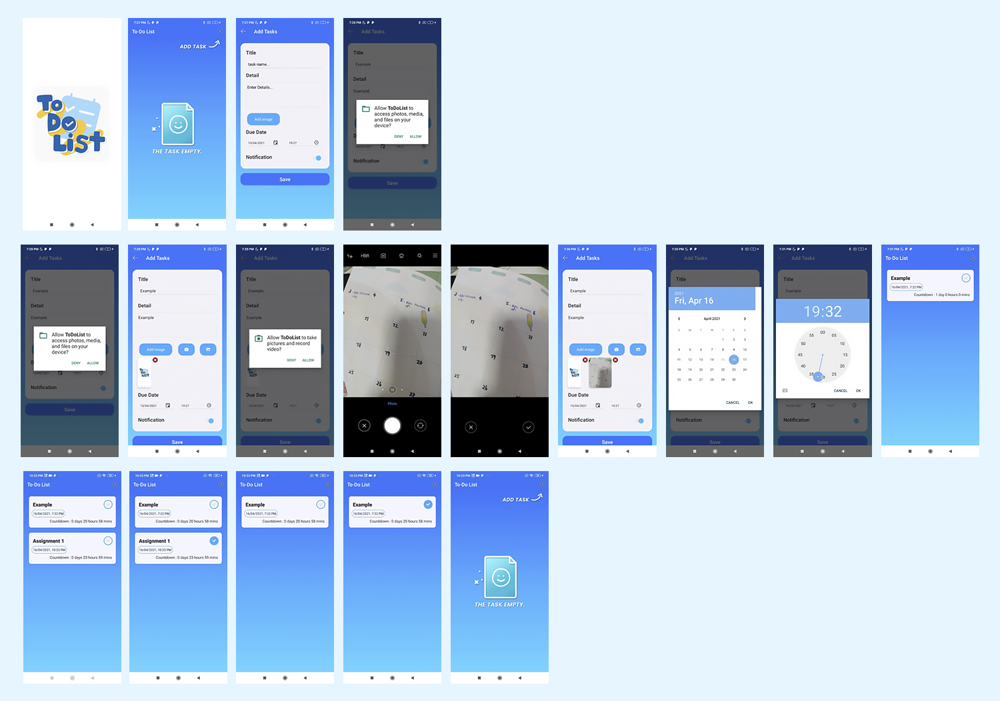

#  To-Do List 📝
🚀 Build Native Mobile Applications With NativeScript Angular


## Getting Started

🚀 First follow this instruction to setup nativescript : https://docs.nativescript.org/environment-setup.html


### Android

1. Clone ```git clone https://github.com/SupansaTan/To-Do-List.git```
2. Change Directory `cd To-Do-List`
3. Start `ns run android`

## App Flow

